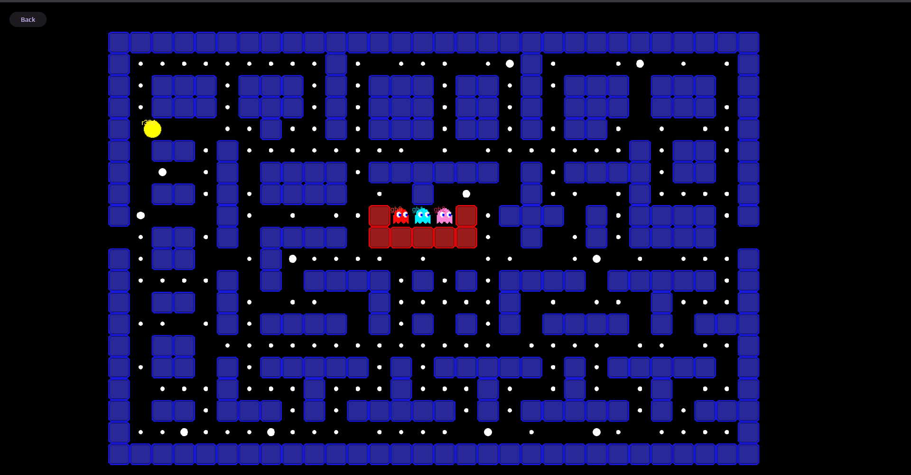

# Multiplayer Pacman

A real-time multiplayer Pacman game built with Phaser.js and Go WebSocket backend. 

Experience the classic arcade game with friends in an exciting multiplayer format!

🎮 **[Play Now](https://multipacman.radn.dev/)** 🎮

<div align="center">
  
  
</div>

### Features

- **Real-time multiplayer gameplay** - Compete with friends online
- **WebSocket-powered** - Low-latency communication for smooth gameplay
- **Classic Pacman mechanics** - Familiar gameplay with a multiplayer twist
- **Easy deployment** - Docker support for quick self-hosting

## Quick Start

### Play Online
Visit [multipacman.radn.dev](https://multipacman.radn.dev/) to start playing immediately!

### Self-Hosting

#### Using Docker (Recommended)
```bash
docker run -p 11300:11300 ghcr.io/ra341/multipacman:release
```

#### Using Docker Compose
```yaml
version: '3.8'
services:
  multipacman:
    container_name: multipacman
    image: ghcr.io/ra341/multipacman:release
    ports: 
      - "11300:11300"
    volumes:
      - ./appdata:/app/appdata/
    restart: unless-stopped
```

Then navigate to `http://localhost:11300` in your browser.

## License

This project is open source and available under the [GPL3](LICENSE).

## Disclaimer

This project is a fan-made implementation of Pacman created for educational and portfolio purposes only. Pacman and all related characters, sounds, and assets are trademarks of Bandai Namco Entertainment. 

This project is not affiliated with, endorsed by, or connected to Bandai Namco Entertainment in any way. All game mechanics, visual styles, and character designs inspired by the original Pacman are used under fair use for educational purposes. No copyright infringement is intended.

## Acknowledgments

- Original Pacman game by Namco
- Phaser.js community for the excellent game framework
- Go community for libraries and tools
