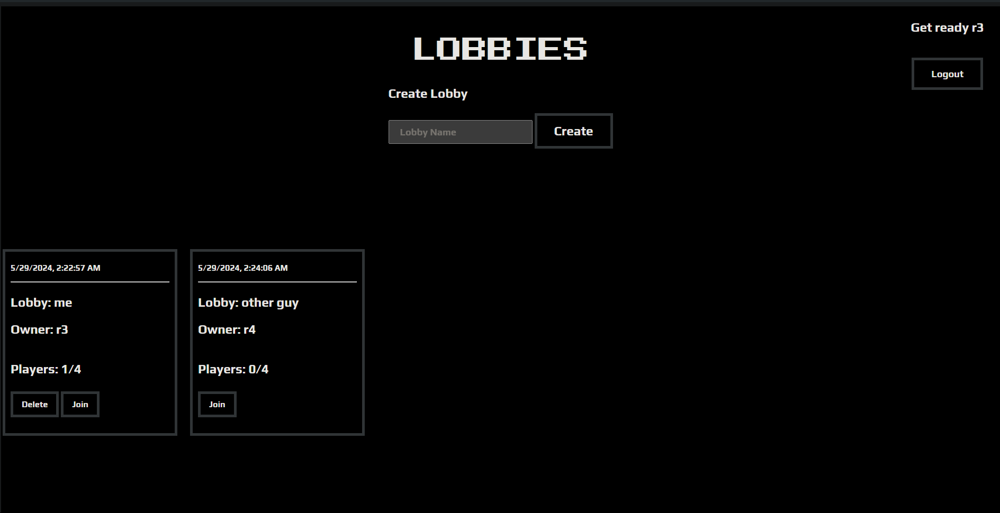
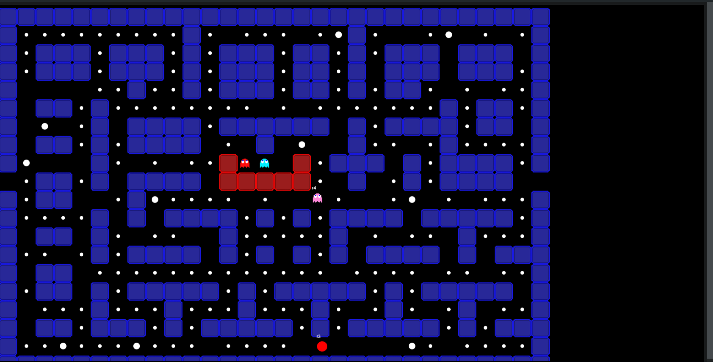

# Multiplayer pacman

## Screenshots

Lobby



Game with 2 players joined



### Running the app

#### Docker run

* Build the image

```bash
docker build -t multipacman .
```

* Docker run

```bash
docker run -d --name multipacman -p 8080:5000 -v $(pwd)/appdata:/root/db --restart unless-stopped multipacman
```

*Note: You can ignore the volume mount if you don't want previous user data to be saved*

#### Compose

```yaml
  multipacman:
    build:
      context: .
      dockerfile: Dockerfile
    ports:
      - "8080:5000"
    volumes:
      - ./appdata/:/root/db/
    restart: unless-stopped

```

### Motivation

My friends and I originally wrote this using node and express (repo can be found [here](https://github.com/brocodedude/MULTI-PACMAN)). Now I am rewriting it in go because I like go and this is a fun challenge.