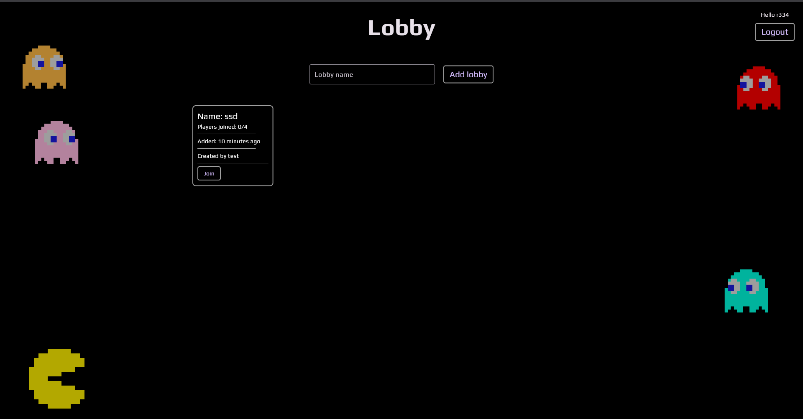

# Multiplayer Pacman

A real-time multiplayer Pacman game built using Flutter, Flame game engine, and Go.

<div align="center">
  
  
</div>


## Hosted Instance

🎮 **[Play Now](https://multipacman.dumbapps.org)** 🎮

Try the live demo and experience the multiplayer action firsthand!


## Project Overview

This project reimagines the classic Pacman game as a modern multiplayer experience, featuring:

- Real-time multiplayer functionality with concurrent users
- Responsive and fluid game mechanics powered by the Flame game engine
- Robust client-server architecture with optimized performance

## Tech Stack

### Frontend

- **Flutter**: Cross-platform UI framework for the game client
- **Flame**: 2D game engine for Flutter, used to implement core game mechanics
- **WebSockets**: For real-time game state synchronization and player interactions

### Backend

- **Go**: High-performance backend server handling game logic and state management
- **gRPC**: For efficient API communication between client and server
- **WebSockets**: For real-time bidirectional communication

## Architecture

The game follows a client-server architecture:

1. **Go Backend**: Manages game state, player connections, and core game logic
2. **Flutter Frontend**: Renders the game UI, processes user inputs, and communicates with the server
3. **WebSockets**: Enable real-time synchronization of game state across all connected players
4. **gRPC**: Provides efficient API communication for non-real-time operations

## Getting Started

### Prerequisites

- Docker (for the easiest setup)
- Alternatively: Flutter SDK and Go installed locally

### Quick Start with Docker

```bash
docker run -p 11200:11200 ras334/multipacman:latest
```

Then open your browser and navigate to `http://localhost:11200`

### Manual Setup

#### Backend

```bash
# Clone the repository
git clone https://github.com/yourusername/multipacman.git
cd multipacman/server

# Run the Go server
go run main.go
```

#### Frontend

```bash
cd ../client

# Get Flutter dependencies
flutter pub get

# Run in development mode
flutter run -d chrome  # For web
# Or
flutter run  # For mobile devices
```

## Contributing

Contributions are welcome! Please feel free to submit a Pull Request.

## Disclaimer

This project is a fan-made implementation of Pacman for educational and portfolio purposes only. Pacman and all related
characters, sounds, and assets are trademarks of Bandai Namco Entertainment (formerly Namco). This project is not
affiliated with, endorsed by, or connected to Bandai Namco Entertainment in any way.

All game mechanics, visual styles, and character designs inspired by the original Pacman are used under fair use for
educational purposes. No copyright infringement is intended.

